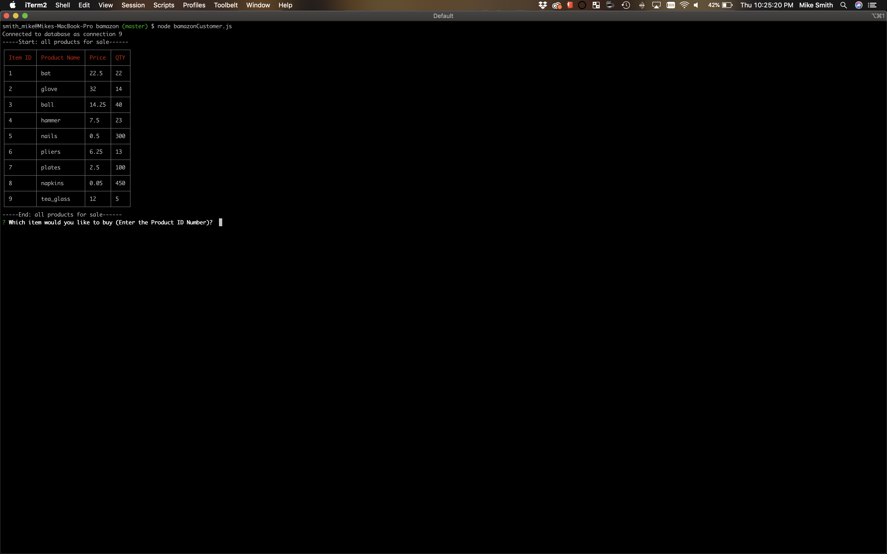
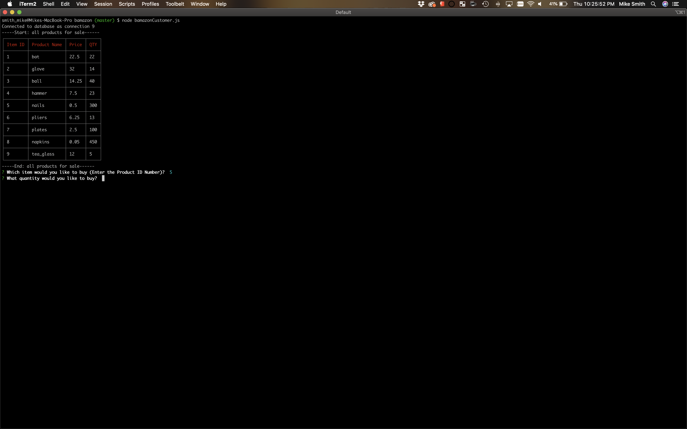
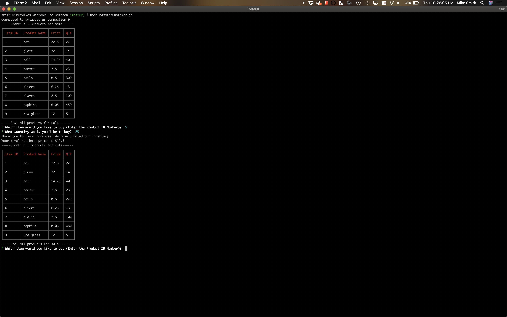
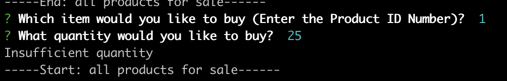

# bamazon

bamazon is a Node.js applicaton that queres a MySQL database to allow the user to interact with the data via CLI. 

## Installation

Run Node Package Manager to install the dependencies located in the package.json file.

```bash
npm install
```

## Usage

Run the following code in your terminal to start the app. See the following screen shots to make sure that you are running the program correctly. 

```bash
node bamazonCustomer.js
```

This is what you see when you run the above command 


Once you answer the question with an id, you then are asekd to provide at qty you would like to purchase 

If you entered a vaild qty then the app will process your purcahse, tell you your total and then restart the app. 

If you input a qty that is larger than the qty on hand the app will tell you that there is insufficient qty and restart the app 